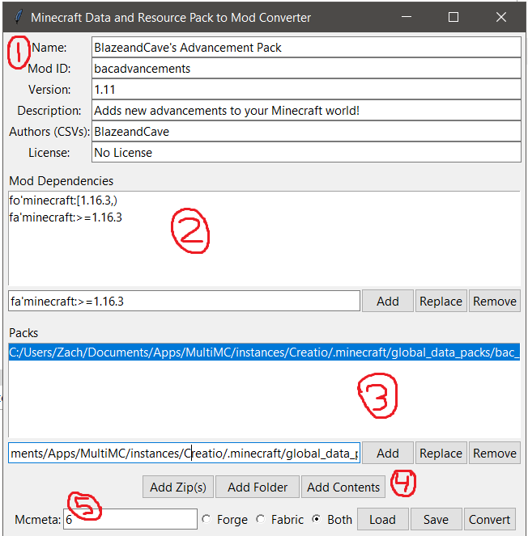

# Minecraft Data and Resource Pack to Mod Converter
Yeah, it's a mouthful, so I shortened it down to mdrpmc.

This program does exactly what the title says. You can use it to compile any number of data and resource packs into a single mod for use in forge, fabric, or both (one jar file that works in both loaders).

## Usage

You can either use the python script itself (with python installed) or get an executable available on the releases page.

[Here](https://youtu.be/oWWGLlsFHE0)'s a video explaining how to use the converter.

Most of the program is self-explanatory, but for those that don't understand, here's an overview of the UI:

1. Put in basic metadata for the mod here. Most of this is required by forge/fabric in order for the mod to load properly. Authors is a comma separated list (e.g., "John, George")
2. Put in mod dependencies here, like a required version of minecraft or some other mod. You can type in the smaller box below in the format `loader'id:version` or `id:version`. `loader` is either `fo` (for forge) or `fa` (for fabric), `id` is the mod id of your choice, and `version` is a version string that would be appropriate to use in that loader's metadata file. Versions differ between forge and fabric, so be careful to use `loader` prefixes when targeting both forge and fabric.
3. This is the list of packs that will be compiled into the mod. You'll most likely want to use (4) to add data and resource packs to this list for compiling. You can use the box to add, edit, or remove items from this list manually.
4. "Add Zip(s)" - Open a file dialog where you can select any number of datapacks in the .zip file format.
   "Add Folder" - Open a file dialog where you can select a single datapack folder that is uncompressed.
   "Add Contents" - Will add every folder and file inside the folder of your choice into the packs list.
5. Make final touches here, like choosing what platform to target, the mcmeta file version (only applicable to Forge), and save/load any configuration of things you inputted into the program. When you would like to finalize the conversion, press "Convert." Eventually you will find the output next to the program in a jar file.